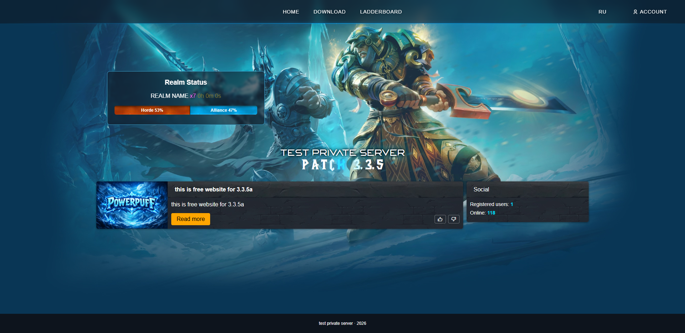

<p align="center">
  
  <br /><br />
  <a href="https://wow2.powerpuff.pro/"></a>
</p>

# wotlk-theme - website for WoW 3.3.5a private servers

A lightweight PHP front-end for **AzerothCore** (or compatible) realms: registration with **SRP6**, news, downloads, realm status, player ladder, voting (MMORating), tickets, and an admin panel. UI is **RU/EN** (language switch in the navbar).

## Features & pages

| Area | Description |
|------|-------------|
| **Home** | News feed, realm status & faction split, **Social** sidebar (registered users, characters online, Discord widget). |
| **News** | `/news/{id}` — full article with image. Logged-in users can like/dislike. |
| **Download** | Torrent/direct links, realmlist copy — texts from admin. |
| **Ladderboard** (`/ladder`) | Top playtime, honorable kills, arena 2v2 / 3v3 / 5v5 (from `characters` / `arena_team`). |
| **Register / Login** | Site account linked to game account (SRP6 + `gmp`). Captcha (Google reCAPTCHA or Cloudflare Turnstile) configurable. |
| **Reset password** | Email link (SMTP optional). |
| **Profile** | Overview, character count from game DB. |
| **Settings** | Email change flow, password reset request. |
| **Vote** | MMORating.top API check + bonus balance (admin: API key, bonus amount). |
| **Shop** | Profile tab (when enabled): bonus balance purchases, categories/subcategories, item links to Wowhead (EN/RU). Delivery via **SOAP** `.send items` to the selected character’s in-game mail. |
| **Messages** | User tickets; staff replies in admin. |
| **Admin panel** | Dashboard stats, news CRUD (with image upload), vote/MMORating settings, download/realmlist strings, tickets, **Social** (Discord server ID + widget theme), **Shop** (SOAP credentials, mail text, enable/disable, items). |

## Requirements

- **PHP** 7.4+ with extensions: `pdo_mysql`, `json`, `session`, `mbstring`, **`gmp`** (required for SRP6 registration), **`soap`** (for the in-game shop), `openssl` (if used).
- **MySQL** / MariaDB — three logical databases: **site** (this app), **auth**, **characters** (AzerothCore).
- Web server with **URL rewrite** to `index.php` (see `.htaccess` for Apache; nginx needs equivalent `try_files`).

## Installation

1. **Upload** the project to your web root (or a subdirectory; set `BASE_PATH` in `configs/config.php` if the site is not at domain root).

2. **Create** a MySQL database for the website and import the schema:
   ```bash
   mysql -u USER -p SITE_DB_NAME < sql/install.sql
   ```

3. **Edit** `configs/config.php`:
   - `SITE_DB_*` - website database (from step 2).
   - `AUTH_DB_*` - AzerothCore **auth** database.
   - `CHARACTERS_DB_*` - AzerothCore **characters** database.
   - `SERVER_NAME`, `REALM_NAME`, `REALM_RATE`, `UPTIME_REALM_ID`, `SITE_PUBLIC_URL` (public URL used in emails and links).
   - Mail: `MAIL_*` and optional SMTP.
   - Optional: `CAPTCHA_*` (see comments in config), MMORating keys are set in **Admin → Voting**.

4. **Permissions** - ensure the web user can write to `storage/news/` (news images).

5. **Web server** - point document root here; enable **mod_rewrite** (Apache) or configure nginx `try_files` to `index.php`.

6. **Admin user** - set `role = 1` for your user in the `users` table (site DB) to access `/profile/adminpanel`.

7. If you already had an older DB, run `sql/migration_discord_widget.sql` if needed for Discord settings keys.

8. For the **shop**, import `sql/migration_shop.sql` (creates `shop_categories`, `shop_items`, default settings, and seeded categories). In **Admin → Shop**, enable the shop, set SOAP host/port/URI/login/password (see below), and add items (item entry ID, price in bonus balance, subcategory).

Open the site, register a test account, and log in to the admin panel to add news, download links, Discord guild ID (Server Settings → Widget in Discord), MMORating API key, and optional shop settings.

## Shop & SOAP (AzerothCore)

**Website**

- Enable the shop and fill SOAP fields under **Admin → Shop**. Default URI is often `urn:AC` (match `worldserver.conf`).
- Bonus balance is stored in the site `users.balance` table (same currency as voting rewards).
- Purchases call the worldserver command: `.send items <CharacterName> "<subject>" "<body>" <itemEntry>[:qty]`.

**Game server (`worldserver.conf`)**

- Set `SOAP.Enabled = 1`.
- Set `SOAP.IP` to an address the **web server can reach** (often `127.0.0.1` if the site and worldserver are on the same machine).
- `SOAP.Port` must match the port you enter in the admin panel (default **7878** is common).
- Create a GM account (or dedicated SOAP account) with permission to run server console commands; put its username/password in the admin SOAP fields.

**Firewall / hosting**

- Allow outbound TCP from the PHP host to `SOAP.IP:SOAP.Port` (or bind SOAP to localhost and run the site on the same host).

**Wowhead links**

- English: `https://www.wowhead.com/wotlk/item=<entry>`
- Russian: `https://www.wowhead.com/wotlk/ru/item=<entry>/`

## Credits

- **Design:** [Horuxia](https://github.com/ph4ntasm93)
- **Development:** [Powerpuff](https://github.com/PowerpuffIO)

---

*Free website template for TrinityCore / AzerothCore 3.3.5a–oriented communities.*

<p align="center">
  <a href="ru.md"></a>
</p>
